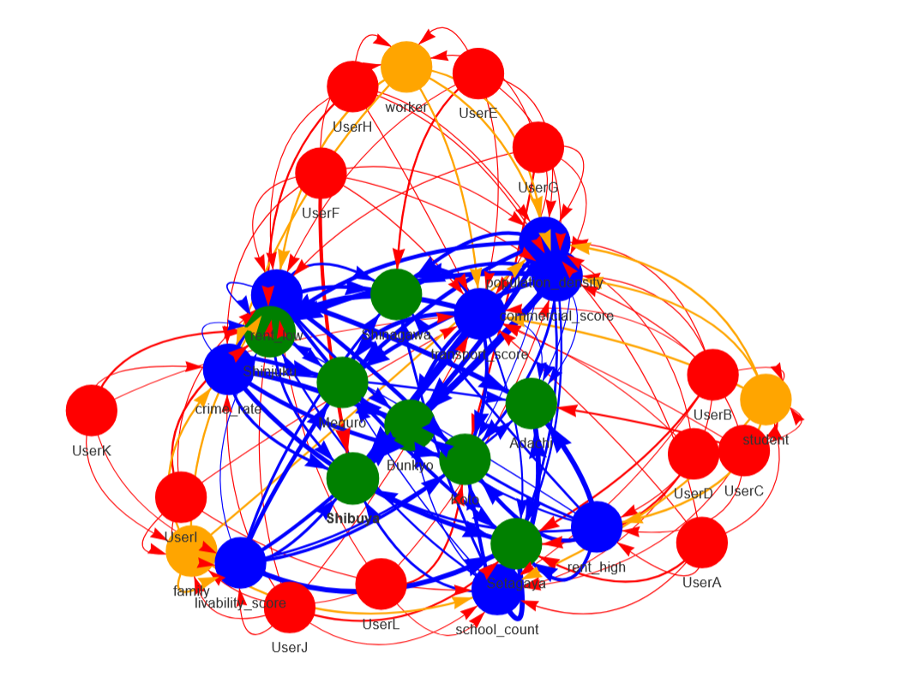
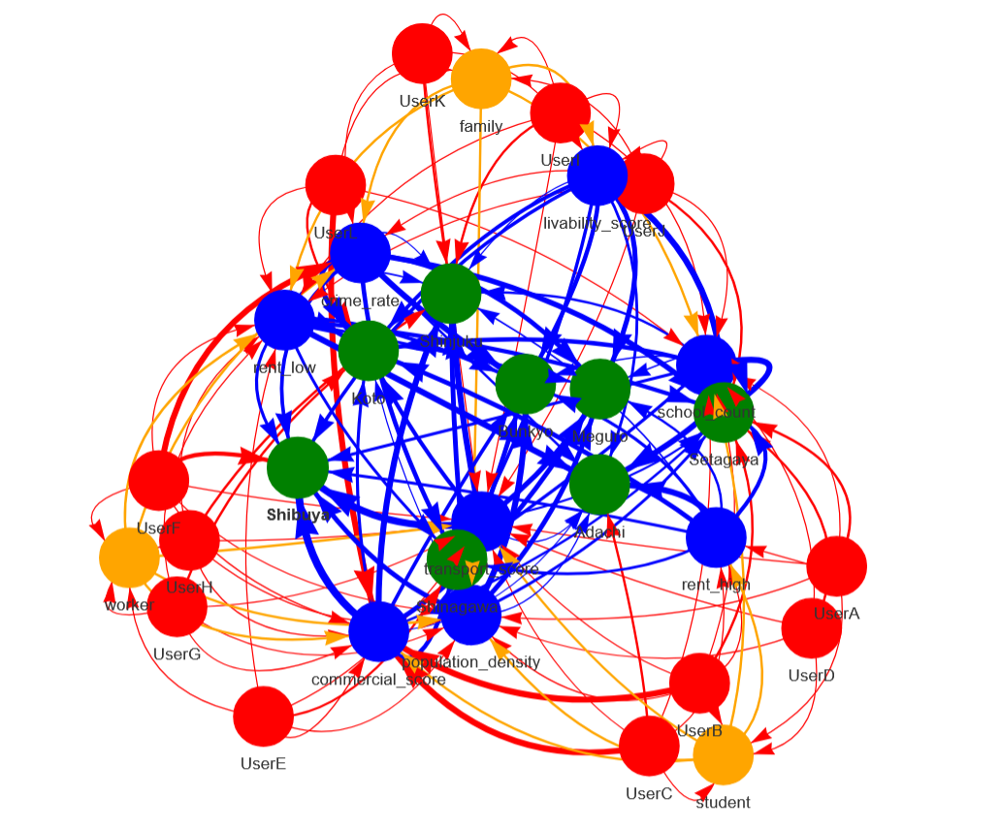

# Graph-Based Co-Creation for Urban Decision Discovery

## Overview

This project investigates how heterogeneous users interact with real-world urban data to construct decisions, and how hidden opportunity structures can emerge from these interactions.

Unlike traditional reinforcement learning approaches that optimize individual decisions under predefined objectives, this work focuses on discovering decision structures formed through multi-agent interactions with heterogeneous data.

Using real Tokyo ward-level data (e.g., rent, population density, education, crime, transport, and livability), this project builds a graph-based co-creation framework to simulate user behavior and identify rare but structurally significant patterns via anomaly detection.

This approach aligns with the idea of co-creation and chance discovery, where meaningful opportunities emerge from interactions rather than explicit optimization.

---

## Motivation

Previous work focused on modeling decision-making using reinforcement learning in financial environments, investigating how risk preferences and constraints shape portfolio allocation.

However, a key limitation emerged: reinforcement learning tends to encode existing risk structures rather than uncover fundamentally new patterns. Learned policies often reflect known trade-offs instead of revealing unexpected opportunities.

This motivates a shift from optimization to structure discovery.

---

## Core Idea

Decision-making is modeled as a co-creation process:

User → User Type → Data → Decision

Users selectively interact with heterogeneous data sources, forming a dynamic interaction structure.

---

## Methodology

- Real Tokyo ward-level data (rent, population density, schools, crime, transport, commercial activity, livability)
- Probabilistic user behavior simulation
- Graph construction
- Anomaly-based opportunity discovery

---

## Data Sources

The urban data used in this project is based on publicly available Tokyo ward-level statistics, compiled from multiple open data sources, including:

- Tokyo Metropolitan Government Open Data Portal  
- Japanese Statistics Bureau (e-Stat)  
- Public real estate listings and housing reports  
- Urban infrastructure and transport accessibility datasets  

The dataset includes key urban indicators such as:

- housing rent (low / high range)
- population density
- number of elementary schools
- crime rate
- transport accessibility
- commercial activity
- livability indicators

These features are aggregated and normalized to construct a consistent multi-dimensional representation of urban environments.

The dataset serves as a structured approximation of real urban decision environments, enabling the study of data-driven interaction patterns without requiring proprietary datasets.

---

## Key Findings

- family → commercial_score  
- worker → crime_rate  
- student → commercial_score  

These represent rare but influential patterns.

---

## Relation to Reinforcement Learning

This work extends reinforcement learning research by shifting from individual optimization to multi-agent interaction and opportunity discovery.

---

## Visualization

### Full Graph Structure

The complete decision graph represents the relationships between users, data, and urban decisions.

- Red nodes: Users  
- Orange nodes: User types  
- Blue nodes: Data features  
- Green nodes: Decision nodes (Tokyo wards)  

---

### Anomaly-Highlighted Graph

The anomaly-enhanced graph highlights rare but structurally important patterns.

- Red edges indicate high anomaly scores  
- Edge thickness reflects influence strength  

---

## Outputs

- outputs/network_real_v2.html  
- outputs/network_real_v2_anomaly.html  
- outputs/anomaly_results.csv  

---

## How to Run

pip install -r requirements.txt

python src/generate_user_behavior.py  
python src/build_graph.py  
python src/score_anomalies.py  
python src/visualize_anomalies.py  

---

## Project Structure

src/        core logic  
data/       input datasets  
outputs/    generated results  
archive/    development history  

---

## Future Directions

- integrating real user behavior logs  
- dynamic graph evolution  
- reinforcement learning for adaptive decision modeling  
